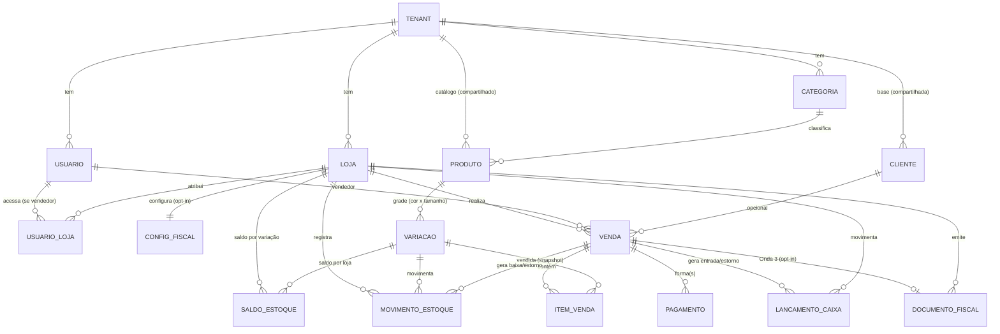

# Etapa 1 — Arquitetura de Domínio

> **Resumo (bata o olho):** O modelo gira em torno de um **Tenant** (a conta do negócio) que
> tem **1–5 Lojas**. **Catálogo e clientes são do Tenant** (compartilhados); **estoque, vendas
> e caixa são da Loja** (segregados). Duas decisões estruturais sustentam tudo: **estoque e
> caixa são razões de movimentos (ledger), não saldos editáveis** — o que dá auditoria,
> estorno e inventário corretos; e **a venda é imutável** — cancelar é estornar, nunca apagar.
> Campos fiscais já entram no modelo (mesmo emitindo só na Onda 3), atrás de um **adaptador de
> provedor fiscal**. Documento orientado a quem vai modelar o banco e o backend.

Relacionado: `requisitos-mvp-gestao-loja-moda.md` (o quê/porquê) e
`posicionamento-e-proposta-de-valor.md` (as leis de simplicidade que o modelo precisa honrar).

---

## 1. Princípios de arquitetura (decisões transversais)

Estas valem para **todas** as entidades. São decisões, não opções.

| # | Decisão | Porquê |
|---|---------|--------|
| A1 | **Multi-tenant por linha:** um único banco; **`tenant_id` em toda tabela**; preparado para Row-Level Security (RLS). | Simples e econômico para micro-SaaS. Schema/DB por tenant é overkill operacional. Isolamento garantido por RLS + filtro obrigatório. |
| A2 | **Estoque e Caixa são *ledgers* (append-only).** A verdade é o histórico de movimentos; o saldo é um **valor materializado** (cache) recalculável a partir dos movimentos. | Dá **auditoria, estorno e inventário** corretos e reconciliáveis. Saldo editável "na mão" corrompe e não tem rastro. |
| A3 | **Venda é imutável após concluída.** Cancelamento cria movimentos de reversão e muda o *status* — **nunca** apaga. | Integridade contábil/fiscal e histórico confiável (a Cláudia precisa confiar nos números). |
| A4 | **Snapshot de dados na transação.** Item de venda guarda **cópia** de preço, nome, cor e tamanho no momento da venda. | O histórico não pode mudar quando o produto é editado depois. |
| A5 | **Identidade = UUID.** | Geração no cliente/serviço, sem colisão entre lojas, seguro para sincronização offline (PWA). |
| A6 | **Dinheiro = inteiro em centavos.** Nunca `float`. | Evita erro de arredondamento financeiro. |
| A7 | **Tempo = UTC** no armazenamento; fuso aplicado na exibição. | Multi-loja e relatórios consistentes. |
| A8 | **Sem hard-delete.** Entidades de cadastro usam *status*/arquivamento. | Preserva integridade referencial e histórico. |
| A9 | **Auditoria mínima** em tudo: `created_at`, `created_by`, `updated_at`. | Suporte, confiança e diagnóstico. |
| A10 | **Padrão inteligente > campo obrigatório.** Todo campo que dá pra derivar (ex.: fiscal por categoria) nasce preenchido. | Lei de simplicidade — proteger a promessa dos "15 minutos". |

---

## 2. Mapa de entidades

**Os três níveis de escopo** (a regra mental que evita o erro do multi-loja):

| Nível | Entidades | Significado |
|-------|-----------|-------------|
| **Tenant** (compartilhado) | Usuário, Categoria, **Produto, Variação**, Cliente | Cadastrado uma vez, vale para todas as lojas |
| **Loja** (segregado) | **SaldoEstoque, MovimentoEstoque, Venda, LançamentoCaixa**, DocumentoFiscal, ConfigFiscal | Cada loja tem o seu, isolado |
| **Transação** (imutável) | ItemVenda, Pagamento | Snapshot do momento; nunca muda |

> **Por que o produto é do Tenant mas o estoque é da Loja:** a Cláudia cadastra "Tênis X
> Preto 38" **uma vez**; cada loja tem **seu próprio saldo** desse mesmo item. Errar isso
> (estoque colado no produto) quebra multi-loja na raiz — por isso é decisão de fundação.

---

## 3. As entidades (propósito, atributos-chave, invariantes)

### 3.1 Tenant (Conta)
O negócio do cliente. Raiz de tudo.
- **Chave:** `id`. **Atributos:** `nome_negocio`, `documento` (CNPJ/CPF, opcional no cadastro), `plano`, `status`, `created_at`.
- **Invariante:** toda entidade do sistema pertence a exatamente um Tenant.

### 3.2 Usuário & UsuárioLoja (acesso)
Quem usa o sistema. Papéis básicos (sem permissões granulares no MVP).
- **Usuário:** `id`, `tenant_id`, `nome`, `email`/`telefone`, `senha_hash`, `papel` (`DONO` | `VENDEDOR`), `status`.
- **UsuarioLoja:** vincula um `VENDEDOR` a uma ou mais lojas. **`DONO` vê todas** sem precisar de vínculo.
- **Invariantes:** `DONO` enxerga todas as lojas e o consolidado; `VENDEDOR` só as lojas vinculadas e **não** vê faturamento consolidado nem configurações (US-7.3).

### 3.3 Loja
Unidade de operação. Estoque, venda e caixa orbitam a Loja.
- `id`, `tenant_id`, `nome`, `endereco` (opcional), `status`.
- **Invariante:** Tenant tem 1..5 Lojas (limite do ICP; validável por plano).

### 3.4 Categoria
Organiza o catálogo **e** alimenta os padrões fiscais.
- `id`, `tenant_id`, `nome`, `parent_id` (opcional, 1 nível), `tipo_moda` (`CALCADO` | `ROUPA` | `ACESSORIO`).
- **Decisão:** `tipo_moda` existe para **derivar NCM/origem padrão** (A10) — a Cláudia escolhe a categoria, o fiscal vem junto.

### 3.5 Produto
Item do catálogo, **a nível Tenant**. Guarda a "casca" e os defaults.
- `id`, `tenant_id`, `nome`, `categoria_id`, `preco_base_centavos`, `descricao`, `status`.
- **Fiscais (default, herdáveis):** `ncm`, `cest`, `origem`, `unidade`. Preenchidos por padrão a partir da Categoria; editáveis só no modo avançado.
- **Invariante:** um Produto tem ≥ 1 Variação (mesmo produto "sem grade" vira 1 variação única).

### 3.6 Variação (SKU)
A combinação **cor × tamanho** — a unidade real de estoque e venda.
- `id`, `tenant_id`, `produto_id`, `cor` (rótulo), `tamanho` (rótulo), `sku_interno` (auto), `codigo_barras` (opcional), `preco_centavos` (**nullable** — override do preço base), `ativo`.
- **Decisões:** cor/tamanho são **rótulos simples**, não um sistema de atributos genérico (variações além de cor/tamanho ficam *fora do produto* — simplicidade). Geração da grade cria as combinações; o usuário pode **desmarcar** as inexistentes (US-1.1).
- **Preço efetivo** = `variacao.preco_centavos ?? produto.preco_base_centavos`.

### 3.7 Estoque — SaldoEstoque (cache) + MovimentoEstoque (verdade)
O coração do multi-loja. **Ledger por (loja, variação).**
- **MovimentoEstoque** (append-only): `id`, `tenant_id`, `loja_id`, `variacao_id`, `tipo` (`ENTRADA` | `SAIDA` | `VENDA` | `ESTORNO_VENDA` | `ACERTO_INVENTARIO` | `AJUSTE`), `quantidade` (com sinal), `custo_unitario_centavos` (opcional, em entradas), `origem_tipo`/`origem_id` (ex.: aponta para a Venda), `observacao`, `usuario_id`, `created_at`.
- **SaldoEstoque** (materializado): `tenant_id`, `loja_id`, `variacao_id`, `quantidade`, `atualizado_em`. **Sempre** = Σ dos movimentos.
- **Invariantes:**
  - `SaldoEstoque.quantidade == Σ MovimentoEstoque.quantidade` para a mesma (loja, variação) — reconciliável a qualquer momento.
  - Inventário (US-2.3) **não edita o saldo direto**: calcula a diferença e grava um `ACERTO_INVENTARIO`.
  - Saldo pode ficar **negativo** só via "venda sem estoque" com confirmação explícita (P1/US-3.1), sinalizando pendência.

### 3.8 Venda (+ ItemVenda + Pagamento)
O evento que gera valor — e a métrica North Star.
- **Venda:** `id`, `tenant_id`, `loja_id`, `numero` (sequencial **por loja**), `status` (`CONCLUIDA` | `CANCELADA`), `cliente_id` (opcional), `vendedor_id`, `subtotal_centavos`, `desconto_centavos`, `total_centavos`, `created_at`, `cancelada_em`, `motivo_cancelamento`.
- **ItemVenda:** `id`, `venda_id`, `variacao_id`, `quantidade`, `preco_unitario_centavos` (**snapshot**), `desconto_centavos`, `total_centavos`, + snapshot `produto_nome`, `cor`, `tamanho`.
- **Pagamento:** `id`, `venda_id`, `forma` (`DINHEIRO` | `PIX` | `DEBITO` | `CREDITO`), `valor_centavos`. (Permite split; o comum é um só.)
- **Invariantes (a transação atômica de venda):** ao concluir uma Venda —
  1. para cada item, nasce **1 `MovimentoEstoque(VENDA)`** na loja; e
  2. nasce **1+ `LancamentoCaixa(ENTRADA)`** referenciando a venda; e
  3. `Σ Pagamento.valor == Venda.total`.
  - **Cancelar** (US-3.3) ⇒ `status=CANCELADA` + `MovimentoEstoque(ESTORNO_VENDA)` (devolve o estoque) + `LancamentoCaixa` de estorno. Nunca delete (A3).

### 3.9 Caixa — LançamentoCaixa (ledger)
O "quanto eu tenho" — pergunta nº 1 do lojista.
- `id`, `tenant_id`, `loja_id`, `tipo` (`ENTRADA` | `SAIDA`), `categoria` (`VENDA` | `SANGRIA` | `SUPRIMENTO` | `DESPESA` | `OUTRO`), `valor_centavos`, `forma_pagamento` (opcional), `origem_tipo`/`origem_id` (ex.: Venda), `descricao`, `usuario_id`, `data`, `created_at`.
- **Saldo do dia** = Σ lançamentos da loja na data. **Resumo por forma de pagamento** = agregação (US-4.2).
- **Decisão de escopo:** **sem** abertura/fechamento formal de caixa (sessão) no MVP — fica como evolução. O ledger por data resolve o fluxo diário (US-4.1) sem adicionar uma cerimônia que a Cláudia não pediu.

### 3.10 Cliente
Cadastro mínimo + histórico. **A nível Tenant.**
- `id`, `tenant_id`, `nome`, `telefone`, `email` (opcional), `documento` (opcional), `observacao`, `created_at`.
- **Histórico de compras** = consulta às Vendas com `cliente_id` (não é entidade nova).
- **Fora (posicionamento):** zero campos de CRM/fidelidade/cashback.

### 3.11 Fiscal — ConfigFiscal + DocumentoFiscal + ProvedorFiscal (Onda 3, opt-in)
Modelado **agora**, emitido **na Onda 3**. Isolado para não tocar o caminho feliz de quem não emite.
- **ConfigFiscal (por Loja):** `loja_id`, `fiscal_ativo` (**opt-in**), `regime_tributario` (`SIMPLES`...), `crt`, `inscricao_estadual`, `csc_id`, `csc_token`, `certificado_ref`, `ambiente` (`HOMOLOGACAO` | `PRODUCAO`).
- **DocumentoFiscal:** `id`, `tenant_id`, `loja_id`, `venda_id`, `tipo` (`NFCE`), `provedor` (`FOCUS_NFE`), `status` (`PENDENTE` | `AUTORIZADO` | `REJEITADO` | `CANCELADO`), `chave_acesso`, `numero`, `serie`, `protocolo`, `xml_ref`, `danfe_ref`, `mensagem_erro`, `created_at`.
- **ProvedorFiscal = adaptador (interface, não tabela):** `emitir(venda) → DocumentoFiscal`, `cancelar(doc)`, `consultar(doc)`. Implementação inicial **Focus NFe**; trocável por ACBr/outro sem mexer no domínio (decisão da §2.1 do posicionamento; lição da Nuvem Fiscal).
- **Invariante:** Loja com `fiscal_ativo=false` ignora todo o fiscal — a venda fecha sem nota e sem pedir nenhum campo fiscal.

---

## 4. Invariantes globais (a "constituição" do domínio)

1. **Isolamento:** nenhuma consulta/escrita cruza `tenant_id`. (RLS reforça.)
2. **Escopo de estoque:** todo saldo/movimento é de um par **(loja, variação)** — nunca "do produto".
3. **Conservação:** `SaldoEstoque == Σ MovimentoEstoque`; `Caixa do dia == Σ LancamentoCaixa`. Tudo reconciliável.
4. **Atomicidade da venda:** Venda CONCLUIDA ⟺ existem os movimentos de estoque e os lançamentos de caixa correspondentes. Nada de venda "pela metade".
5. **Imutabilidade:** transações (venda/movimento/lançamento) não se editam; corrigem-se por reversão.
6. **Histórico fiel:** o que aconteceu fica congelado por snapshot, imune a edições futuras de cadastro.

---

## 5. O que fica fora do modelo agora (com ganchos)

| Fora agora | Gancho deixado | Quando |
|------------|----------------|--------|
| Transferência de estoque entre lojas | `MovimentoEstoque` já tem `tipo`; basta um par `SAIDA`/`ENTRADA` ligado | Backlog |
| Permissões granulares | `Usuario.papel` evoluível para tabela de papéis/permissões | Backlog |
| Multi-depósito / WMS | — (fora do produto) | Nunca |
| Motor de promoção / fidelidade / cashback | — (fora do produto + Promo-Engine/Growth OS) | Nunca |

---

## 6. Extensões de escopo (decididas 14/06/2026)

> **Aviso de simplicidade:** estas extensões **quase dobram o domínio**. Por isso a maioria é
> sequenciada para Ondas 2–3; a **Onda 1 mantém só a espinha transacional**. A onda de cada
> item está marcada. Princípios A1–A10 (ledger, imutabilidade, snapshot) continuam valendo.

### 6.1 Catálogo mais rico *(Onda 1, leve)*
- **Marca:** `id`, `tenant_id`, `nome`. → `Produto.marca_id?`
- **Coleção/Estação:** `id`, `tenant_id`, `nome`, `ano`, `estacao`. → `Produto.colecao_id?`
- **Precificação no Produto:** `custo_compra_centavos`, `custos_adicionais_centavos` (frete/impostos rateados — *Onda 3*), `markup_percentual`, `preco_sugerido_centavos` (derivado), `preco_venda_centavos` (praticado). **Margem** = derivada. ⚠️ Planejamento de preço ≠ **custo médio real** (este vem das ENTRADAS no ledger — A2).

### 6.2 Fornecedor & Entrada *(Onda 1)*
- **Fornecedor:** `id`, `tenant_id`, `nome`, `documento?`, `contato?`, `status`. (Nível Tenant.)
- **EntradaEstoque** (cabeçalho opcional que agrupa movimentos): `id`, `tenant_id`, `loja_id`, `fornecedor_id?`, `numero_nota?`, `data`, `observacao`. Cada item gera `MovimentoEstoque(ENTRADA)` com custo.

### 6.3 Caixa com sessão — abertura/fechamento *(Onda 1)*
- **SessaoCaixa:** `id`, `tenant_id`, `loja_id`, `status` (`ABERTA`|`FECHADA`), `valor_abertura_centavos`, `aberta_por`/`aberta_em`, `valor_fechamento_informado_centavos` (contagem), `valor_fechamento_calculado_centavos` (derivado), `diferenca_centavos`, `fechada_por`/`fechada_em`.
- `LancamentoCaixa.sessao_caixa_id`. **Invariante:** lançamento só entra em sessão `ABERTA`; o fechamento congela e mostra a **diferença** (contado − calculado). Manter leve — não virar ritual de ERP.

### 6.4 Pagamentos configuráveis *(base Onda 1 / cartão Onda 2)*
- **FormaPagamento** (vira **entidade**, não enum): `id`, `tenant_id`, `nome`, `tipo` (`DINHEIRO`|`PIX`|`DEBITO`|`CREDITO`|`CREDIARIO`|`VALE_TROCA`|`OUTRO`), `ativo`. → `Pagamento.forma_pagamento_id`.
- **CondicaoPagamento** (parcelamento, *Onda 2*): `id`, `nome`, `numero_parcelas`, `acrescimo_percentual`, `ativo`.
- **BandeiraCartao + Taxa** (*Onda 2*): `id`, `nome`, `tipo`, `taxa_percentual`, `prazo_recebimento_dias` → calcula **valor líquido** e habilita conciliação com a maquininha.

### 6.5 Crediário / Contas a Receber *(Onda 2 — a killer feature)*
> O caderno de fiado virando produto — materialização do manifesto *"pare de controlar no caderno"*.
- **ContaReceber:** `id`, `tenant_id`, `loja_id`, `cliente_id` (**obrigatório**), `venda_id`, `valor_total_centavos`, `status` (`ABERTA`|`PARCIAL`|`QUITADA`).
- **Parcela:** `id`, `conta_receber_id`, `numero`, `valor_centavos`, `vencimento`, `status` (`ABERTA`|`PAGA`|`ATRASADA`), `pago_em`.
- **RecebimentoParcela:** `id`, `parcela_id`, `valor_centavos`, `forma_pagamento_id`, `recebido_em` → gera `LancamentoCaixa(ENTRADA)`.
- **Invariantes:** fiado exige cliente (**não há crediário anônimo**); Σ parcelas = total; baixa de parcela alimenta o caixa; dashboard ganha *"a receber / vencendo"*. Juros/multa por atraso = *Onda 3*.

### 6.6 Troca & Devolução *(Onda 2 — crítico em moda)*
- **Devolucao:** `id`, `tenant_id`, `loja_id`, `venda_origem_id`, `tipo` (`DEVOLUCAO`|`TROCA`), `itens_devolvidos`, `itens_novos?`, `diferenca_valor_centavos`, `resolucao` (`ESTORNO`|`VALE_TROCA`|`NOVA_VENDA`).
- **ValeTroca:** `id`, `tenant_id`, `codigo`, `cliente_id?`, `valor_centavos`, `status` (`ATIVO`|`USADO`|`EXPIRADO`). Usável como `FormaPagamento(VALE_TROCA)`.
- Devolução gera `MovimentoEstoque` de retorno (entrada); troca = retorno + nova saída. Reusa a imutabilidade (A3): **nunca** edita a venda original.

### 6.7 Comissão & Metas *(comissão Onda 2 / metas Onda 3)*
- **RegraComissao:** `id`, `tenant_id`, `escopo` (`LOJA`|`VENDEDOR`|`CATEGORIA`), `percentual`, `vigencia`.
- **Comissão apurada:** derivada das vendas por vendedor/período (snapshot ao fechar período).
- **MetaVenda** (*Onda 3*): `id`, `tenant_id`, `loja_id?`/`vendedor_id?`, `periodo`, `valor_meta_centavos` → acompanhamento realizado × meta.

### 6.8 Comprovante não-fiscal *(Onda 1)*
Não é entidade — é uma **renderização** da Venda (recibo imprimível/compartilhável) para o balcão, válida antes da NFC-e (Onda 3).

---

## 7. Próximos passos a partir daqui

1. **Validar este modelo** (revisão técnica) — índices (ex.: `(tenant_id, loja_id, variacao_id)` em estoque; `(loja_id, data)` em caixa; `(conta_receber_id, vencimento)` em parcelas) e materialização do saldo, com `database-architect`.
2. **Traduzir no `schema.prisma`** — as entidades das §3 e §6 viram o schema que destrava o backend.
3. **Etapa 2 (UX)** — os 5 fluxos agora têm um modelo concreto por baixo para desenhar em cima.

---

*Documento vivo — v1. É a fonte da verdade do domínio. Mudou uma regra de negócio? Atualize as
invariantes aqui antes do código.*
